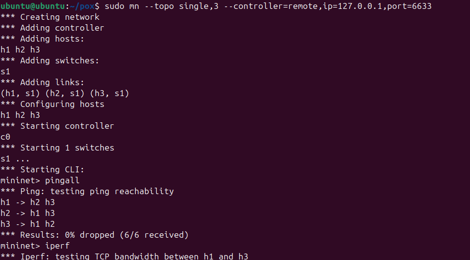
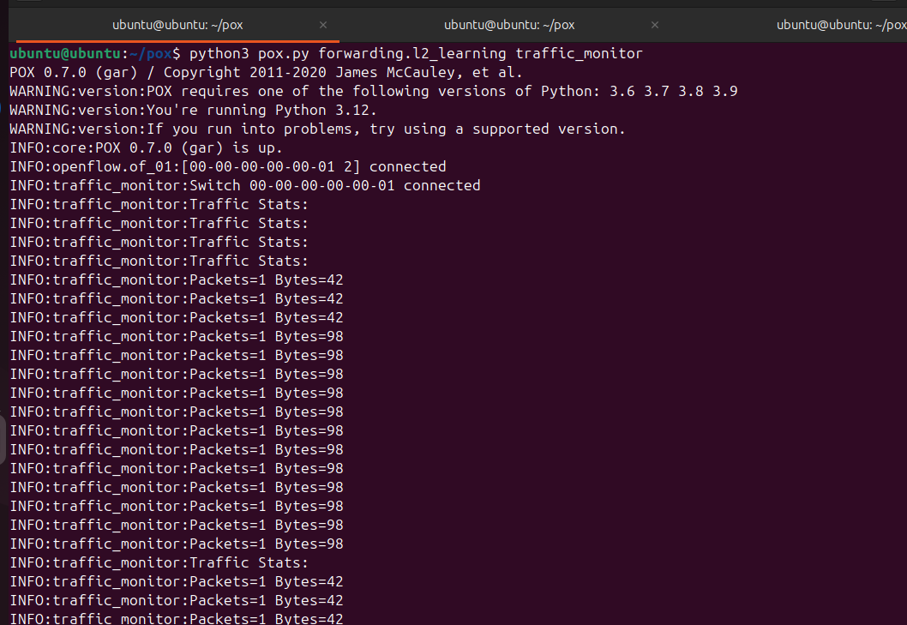
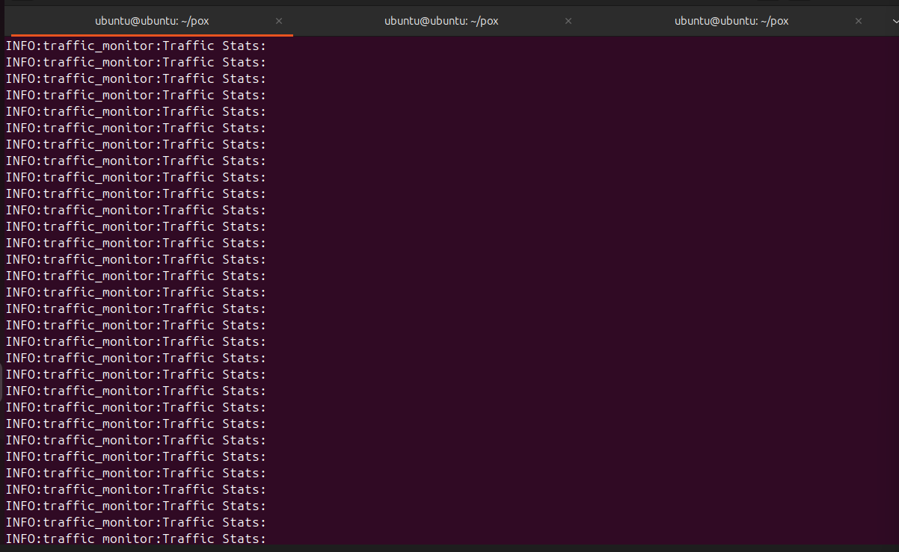
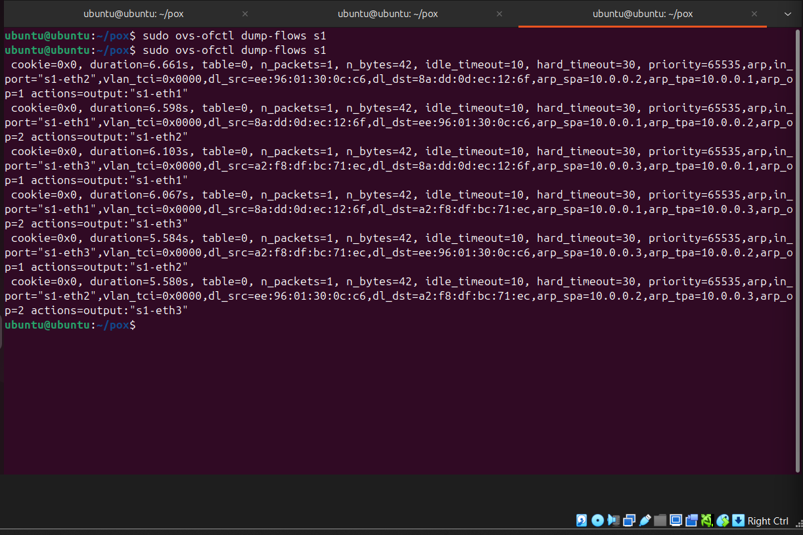

# SDN Traffic Monitoring using POX

## Problem Statement
Build a controller module that collects and displays traffic statistics.

## Objective
- Retrieve flow statistics
- Display packet and byte counts
- Perform periodic monitoring
- Generate simple reports

## Tools Used
- Mininet
- POX Controller
- Python

## How it Works
- POX controller connects to Mininet switch
- It collects flow statistics every 5 seconds
- Displays packets and bytes in terminal
- Stores results in report.txt

## Execution Steps
1. Start POX:
   python3 pox.py forwarding.l2_learning traffic_monitor

2. Start Mininet:
   sudo mn --topo single,3 --controller=remote,ip=127.0.0.1,port=6633

3. Run ping:
   pingall

## Output
- Displays packet count and byte count  
- Traffic statistics printed continuously  
- Report saved in report.txt  

## Result
Successfully implemented an SDN controller for traffic monitoring.

## Proof of Execution

### Ping Test

### Iperf Test

### Traffic Monitoring
  

### Flow Table

## References
- POX Documentation  
- Mininet Documentation  
